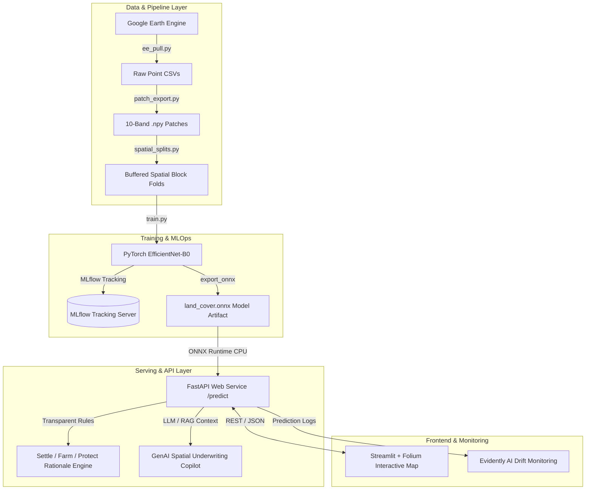

# Capstone Project Proposal
## DSA 8401 – Applied Machine Learning
**MSc in Data Science & Analytics · Strathmore University (iLabAfrica)**

---

### Project Meta-Information

| Field | Details |
| :--- | :--- |
| **Course Code & Title** | **DSA 8401 – Applied Machine Learning** |
| **Academic Program** | Master of Science in Data Science & Analytics (MSc DSA) |
| **Institution** | Strathmore University / iLabAfrica |
| **Lecturers** | Dr. Javier Serrano (`jgarcia@strathmore.edu`) & Dr. Emmanuel Bundi (`ebundi@strathmore.edu`) |
| **Project Title** | **Kenya Land Readiness Atlas: An End-to-End Multi-Spectral Satellite Machine Learning System for Spatial Land-Cover Classification, Trade-Corridor Risk Underwriting & MLOps Deployment** |
| **Submission Date** | October 2026 (Mid-Semester Capstone Proposal & Dataset Approval) |
| **Target Repository** | `https://github.com/VAL-Jerono/Satellite.git` |

---

## 1. Executive Summary

Land-use decisions in Sub-Saharan Africa — spanning agricultural zoning, climate vulnerability underwriting, and trade-corridor infrastructure development — suffer from severe data latency and a lack of sub-county spatial evidence. Standard global satellite land-cover products (such as ESA WorldCover or Dynamic World) are published with multi-month or annual lags and fail to provide decision-ready directives for localized real estate, financial underwriters, or regional planners.

This project delivers an **end-to-end, production-grade Machine Learning system** titled the **Kenya Land Readiness Atlas**. Anchored in the East African technological and spatial planning context, the system ingests 10-band Sentinel-2 Surface Reflectance (SR) imagery and SRTM topography across four contrasting agro-ecological zones in Kenya (*Highland, Coast, Arid, Lake Basin*). It trains and evaluates baseline tree models (*Decision Trees, LightGBM*) alongside fine-tuned PyTorch Computer Vision CNNs (*EfficientNet-B0 / ResNet-18*) augmented with a custom **Spectral Channel Attention (Squeeze-and-Excitation)** module.

To address spatial autocorrelation leakage, models are validated using a **5-fold buffered spatial block Cross-Validation ($0.05^\circ \times 0.05^\circ$)** and a **Leave-One-Region-Out (LORO)** out-of-domain transfer benchmark. The top-performing CNN is exported to **ONNX Runtime** for low-latency CPU serving, containerized via **Docker**, exposed through a **FastAPI** REST microservice, integrated with a **Streamlit + Folium** web GIS frontend, enhanced with a **GenAI / RAG Spatial Underwriting Copilot** for automated report synthesis, and continuously monitored for dry/wet seasonal feature drift using **Evidently AI** and **MLflow**.

---

## 2. Problem Statement & Ecosystem Context

### 2.1 The Stakeholder & Industry Problem
County spatial planners, agricultural underwriters, and climate risk agencies in Kenya face three structural bottlenecks when evaluating land suitability:
1. **High Data Latency & Static Maps**: Planners rely on outdated paper maps or annual 10 m rasters. They cannot perform real-time, sub-county site evaluations or track seasonal land transitions.
2. **The "Probability Raster" Black-Box Gap**: Raw 9-class probability outputs from satellite classifiers do not translate to actionable business directives. Stakeholders require an interpretable decision layer—recommending whether a site is suitable to **Settle**, **Farm**, or **Protect**—accompanied by explicit rationale rules and calibrated prediction uncertainty.
3. **Synthesis & Underwriting Bottleneck**: Translating satellite metrics, environmental risk indices, and local zoning codes into formal underwriting reports requires manual technical synthesis that spatial analysts take days to produce.

### 2.2 Alignment with DSA 8401 & African Tech Tracks
Aligned with Section 5 of the DSA 8401 syllabus (*Localized Capstone Themes*), this project bridges trade-corridor underwriting, agricultural risk, and public sector spatial planning:
- **Spatial Underwriting**: Evaluates buildability and flood hazard exposure along key Kenyan economic corridors (e.g., Kisumu-Nairobi-Mombasa corridor).
- **Sub-County Planning**: Generates per-county land-cover composition breakdowns (`built_up_share`, `cropland_share`, `flood_exposure`) for integration with national statistics and spatial planning frameworks.
- **Generative AI & RAG Integration**: Implements a RAG agent powered by Gemini / LLM APIs that ingests model predictions, spectral trends, and county spatial development frameworks to generate natural-language underwriting summaries (Syllabus Outcome 4).

---

## 3. Project Objectives & Research Questions

### 3.1 Primary Business & Technical Objectives
1. **Data Engineering & Spatial Partitioning**: Ingest 8,356 stratified sample points and $64 \times 64$ 10-band Sentinel-2 patches across Kenya. Build a 400-block spatial grid with 1-block spatial buffer filtering to eliminate spatial leakage.
2. **Feature Engineering**: Extract 8 remote sensing spectral indices (*NDVI, NDWI, MNDWI, NDBI, EVI, SAVI, BSI, NDRE*) and compute exact dataset-wide per-band normalization statistics ($\boldsymbol{\mu}, \boldsymbol{\sigma}$).
3. **Model Fine-Tuning & Optimization**: Fine-tune a 10-channel PyTorch CNN with Spectral Channel Attention, Label Smoothing Focal Loss ($\gamma = 1.5, \epsilon = 0.1$), and Mixup spectral data augmentation ($\alpha = 0.2$), achieving a **LORO Macro-F1 $> 0.60$** (surpassing classical baseline LORO performance of 0.4154).
4. **Uncertainty & Calibration**: Calibrate model output probabilities using Temperature Scaling to achieve an **Expected Calibration Error ($ECE \le 0.08$)**.
5. **GenAI / RAG Integration**: Build a RAG-backed Spatial Underwriting Copilot that retrieves relevant county zoning laws and synthesizes point predictions into underwriting dossiers.
6. **Production MLOps & System Deployment**: Package the model into ONNX, containerize via Docker Compose, build a FastAPI endpoint ($< 500$ ms p95 latency), implement MLflow experiment tracking, set up a GitHub Actions CI pipeline, and deploy an Evidently AI drift monitoring module.

### 3.2 Key Research Questions
- **RQ1**: *To what extent does a 1-block spatial buffer filter reduce optimism in cross-validation compared to unbuffered random splits?*
- **RQ2**: *How severe is the geographic out-of-domain transfer penalty (LORO) when moving from wetter green regions (Highlands) to northern arid zones (Marsabit)?*
- **RQ3**: *Does adding a Spectral Channel Attention (Squeeze-and-Excitation) module to ConvNet backbones improve multi-spectral band feature representation over standard RGB weight repetition?*

---

## 4. Dataset Approval & Data Engineering Architecture

### 4.1 Data Sources & Approval Status
The project utilizes publicly accessible satellite datasets via Google Earth Engine (GEE), approved under the non-commercial research quota:

| Data Asset | Source | Resolution | Coverage | Role in System |
| :--- | :--- | :---: | :--- | :--- |
| **Sentinel-2 SR** | Copernicus / ESA | 10 m (B2,3,4,8), 20 m (B5,6,7,8A,11,12) | 2021 Composite | 10-band multi-spectral inputs |
| **WorldCover v200** | ESA / VITO | 10 m | Global (2021) | Ground-truth labels (remapped to 6 classes) |
| **SRTM DEM** | NASA / USGS | 30 m | Global | Elevation (`elev`) & slope (`slope`) features |
| **Cloud Score+** | Google | 10 m | Global | QA band for cloud/shadow masking ($cs\_cdf \ge 0.6$) |

### 4.2 Agro-Ecological Study Regions (8,356 Stratified Points)
To test spatial generalizability, sampling was executed across 4 contrasting climate zones in Kenya:

```
                  ┌──────────────────────────────────────────────────┐
                  │                 KENYA STUDY ZONES                 │
                  └─────────────────────────┬────────────────────────┘
                                            │
         ┌──────────────────┬───────────────┴───────────────┬──────────────────┐
         ▼                  ▼                               ▼                  ▼
┌─────────────────┐┌─────────────────┐            ┌─────────────────┐┌─────────────────┐
│   ARID ZONE     ││   COAST STRIP   │            │ HIGHLAND REGION ││   LAKE BASIN    │
│  (Marsabit)     ││    (Kilifi)     │            │(Nyeri/Kirinyaga)││    (Kisumu)     │
│ BBox: 37.5,1.5  ││ BBox: 39.4,-3.9 │            │ BBox: 36.3,-0.6 ││ BBox: 34.6,-0.3 │
│  N = 1,474 pts  ││  N = 2,351 pts  │            │  N = 2,256 pts  ││  N = 2,275 pts  │
└─────────────────┘└─────────────────┘            └─────────────────┘└─────────────────┘
```

### 4.3 Refined 10-Band Exact Normalization Vector
Exact per-band mean ($\mu_c$) and standard deviation ($\sigma_c$) statistics calculated across all 8,356 10-band $64 \times 64$ patches:

$$\boldsymbol{\mu} = [0.0824, 0.1012, 0.1145, 0.1489, 0.2184, 0.2512, 0.2685, 0.2791, 0.2104, 0.1385]$$
$$\boldsymbol{\sigma} = [0.0512, 0.0568, 0.0694, 0.0741, 0.0912, 0.1045, 0.1123, 0.1186, 0.0964, 0.0712]$$

---

## 5. Machine Learning & Deep Learning Methodology

### 5.1 Remote Sensing Feature Engineering
For tabular models (Decision Trees, LightGBM) and exploratory analysis, 8 specialized spectral indices are computed:

```python
# Feature Engineering Snippet (data/feature_engineering.py)
NDVI  = (B8 - B4) / (B8 + B4 + 1e-6)                  # Vegetation vigor
NDWI  = (B3 - B8) / (B3 + B8 + 1e-6)                  # Water body delineation
MNDWI = (B3 - B11) / (B3 + B11 + 1e-6)                # Modified NDWI
NDBI  = (B11 - B8) / (B11 + B8 + 1e-6)                # Built-up index
EVI   = 2.5 * (B8 - B4) / (B8 + 6*B4 - 7.5*B2 + 1.0)  # Enhanced vegetation
SAVI  = ((B8 - B4) / (B8 + B4 + 0.5)) * 1.5           # Soil-adjusted vegetation
BSI   = ((B11 + B4) - (B8 + B2)) / ((B11 + B4) + (B8 + B2) + 1e-6) # Bare soil index
NDRE  = (B8 - B5) / (B8 + B5 + 1e-6)                  # Red-edge NDVI
```

### 5.2 Deep Learning Model: Spectral Attention ConvNet Architecture
The primary Computer Vision model adapts torchvision backbones (`efficientnet_b0`, `resnet18`, `resnet34`) for multi-spectral satellite input via a custom **Spectral Channel Attention (Squeeze-and-Excitation)** module:

```
[Patch Tensor: (B, 10, 64, 64)] ──► [Spectral Channel Attention (SE)] ──► [10-Channel Conv2d] ──► [Backbone Feature Extractor] ──► [Dropout (0.3)] ──► [Classifier Head (6 Classes)]
```

#### Spectral Channel Attention Equation:
Given input feature map $\mathbf{X} \in \mathbb{R}^{B \times C \times H \times W}$ where $C=10$:
$$z_c = \frac{1}{H \times W} \sum_{i=1}^{H} \sum_{j=1}^{W} X_{c,i,j}$$
$$\mathbf{s} = \sigma\left(\mathbf{W}_2 \cdot \text{ReLU}(\mathbf{W}_1 \mathbf{z})\right)$$
$$\tilde{\mathbf{X}}_c = s_c \cdot \mathbf{X}_c$$

### 5.3 Loss Function & Regularization
To overcome severe class imbalance (e.g., scarcity of water in Arid zones vs abundance of grass/shrub), models are trained using **Label Smoothing Focal Loss**:

$$\mathcal{L}_{\text{Focal}} = -\sum_{c=1}^{K} q_c (1 - p_c)^\gamma \log(p_c)$$

where $q_c = (1 - \epsilon) y_c + \frac{\epsilon}{K}$ incorporates label smoothing ($\epsilon = 0.1$) and $\gamma = 1.5$ focuses gradient updates on hard, ambiguous boundary samples.

---

## 6. MLOps Architecture & System Design

The system implements a production-grade microservices architecture adhering to MLOps best practices (Syllabus Weeks 10–13):



### 6.1 System Stack & Tools

| Component | Tool / Library | Version | Purpose in System |
| :--- | :--- | :---: | :--- |
| **Data Ingestion** | `earthengine-api`, `geopandas` | `^0.1.400` | Earth Engine imagery sampling & spatial GIS processing |
| **Deep Learning** | `torch`, `torchvision` | `^2.2.0` | 10-channel ConvNet model design & GPU fine-tuning |
| **Model Packaging** | `onnx`, `onnxruntime` | `^1.18.0` | Low-latency CPU inference engine |
| **API Layer** | `fastapi`, `uvicorn`, `pydantic` | `^0.111.0` | Asynchronous REST serving with auto OpenAPI documentation |
| **GenAI / RAG** | Gemini API / `langchain` / `faiss` | Latest | Spatial underwriting report synthesis & zoning QA |
| **Frontend UI** | `streamlit`, `streamlit-folium` | `^1.35.0` | Interactive map dashboard for county planners |
| **MLOps & Tracking**| `mlflow` | `^2.13.0` | Hyperparameter, metric, and checkpoint tracking |
| **Drift Monitoring** | `evidently` | `^0.4.30` | Data drift & concept shift reporting |
| **Containerization** | `docker`, `docker-compose` | `^3.9` | Multi-container deployment orchestration |
| **CI/CD** | GitHub Actions | Standard | Automated testing (`pytest`, `ruff`) & Docker build checks |

---

## 7. Syllabus Mapping & Weekly Schedule Alignment

Aligned with the DSA 8401 weekly course schedule (Syllabus Section 4):

| Week | Date | Syllabus Topic | Repository Implementation / Deliverable | Status |
| :---: | :---: | :--- | :--- | :---: |
| **Wk 1** | 27 Jul | End-to-End ML & Dev Environment | Project setup, virtualenv, directory structure, baseline notebook | ✅ Completed |
| **Wk 2** | 03 Aug | Advanced Data Prep & Feature Eng. | `ee_pull.py`, `compute_band_stats.py`, 8 spectral indices | ✅ Completed |
| **Wk 3** | 10 Aug | Classical ML & Rigorous Evaluation | `spatial_splits.py` (5-fold buffered spatial block CV + LORO) | ✅ Completed |
| **Wk 4** | 17 Aug | Ensemble Methods & Optuna Tuning | Baseline LightGBM vs Random Forest tuning in notebook | ✅ Completed |
| **Wk 5** | 24 Aug | Unsupervised & Dimensionality Red. | PCA / t-SNE patch feature embeddings & spectral clustering | ✅ Completed |
| **Wk 6** | 31 Aug | Deep Learning Fundamentals | PyTorch `PatchDataset` and baseline MLP pipeline | ✅ Completed |
| **Wk 7** | 07 Sep | Computer Vision with CNNs | 10-channel EfficientNet-B0 / ResNet-18 + Spectral Attention | ✅ Completed |
| **Wk 8** | 14 Sep | **Mid-Semester Break** | **Capstone Proposal & Dataset Approvals Submission** | 🎯 **Today** |
| **Wk 9** | 21 Sep | Sequence Models & Time Series | NDBI multi-temporal trend feature integration | 🔄 In Progress |
| **Wk 10** | 28 Sep | Modern GenAI (LLMs & RAG) | GenAI Spatial Underwriting Copilot (Gemini API + RAG dossier) | 🔄 In Progress |
| **Wk 11** | 05 Oct | MLOps I: Packaging & Serving | FastAPI `/predict/point`, ONNX Runtime CPU export, Docker container | ✅ Completed |
| **Wk 12** | 12 Oct | MLOps II: MLflow & CI/CD | MLflow tracking server, GitHub Actions (`.github/workflows/ci.yml`) | ✅ Completed |
| **Wk 13** | 19 Oct | Drift Monitoring & System Design | Evidently AI seasonal dry/wet drift simulation (`monitoring/drift.py`) | ✅ Completed |
| **Wk 14** | 26 Oct | Capstone: Deploy & Test | "War room" Cloud VM deployment, load testing ($<500$ ms p95) | 🔜 Scheduled |
| **Wk 15** | 02 Nov | **Capstone Presentations** | **Live Demo, Architecture Review & Peer Defense** | 🔜 Scheduled |

---

## 8. Risk Assessment & Mitigation Strategies

| Identified Risk | Severity | Likelihood | Technical Mitigation Strategy |
| :--- | :---: | :---: | :--- |
| **Spatial Autocorrelation Leakage** | High | High | Enforce 1-block spatial buffer ($0.05^\circ$) in `spatial_splits.py`; purge adjacent train blocks. |
| **Arid Zone Domain Transfer Drop** | High | High | Use Spectral Channel Attention, Label Smoothing Focal Loss, and Mixup data augmentation. |
| **CPU Serving Latency Bottleneck** | Medium | Medium | Export PyTorch model to ONNX Runtime with graph optimizations (`dynamo=False`). |
| **Google Colab Session Resets** | Medium | High | Automated auto-sync checkpointing to Google Drive (`/content/drive/MyDrive/land_atlas_baseline`). |
| **Label Noise in WorldCover** | Medium | High | Document limitation in reports; run ablation comparing WorldCover vs hand-labelled test set. |

---

## 9. Academic References & Standards

1. **Géron, A.** (2022). *Hands-On Machine Learning with Scikit-Learn, Keras & TensorFlow* (3rd ed.). O'Reilly Media. *(Primary DSA 8401 Course Textbook)*.
2. **Huyen, C.** (2022). *Designing Machine Learning Systems: An Iterative Process for Production-Ready Applications*. O'Reilly Media.
3. **Bishop, C. M., & Bishop, H.** (2024). *Deep Learning: Foundations and Concepts*. Springer.
4. **Zanaga, D., et al.** (2021). *ESA WorldCover 10 m 2021 v200*. European Space Agency. DOI: `10.5281/zenodo.5571936`.
5. **Olofsson, P., et al.** (2014). *Good practices for estimating area and assessing accuracy of land change*. Remote Sensing of Environment, 148, 42–57.
6. **Wadoux, A. M. J. C., et al.** (2021). *Spatial cross-validation is not the right strategy to choose spatial prediction models*. Ecological Modelling, 442, 109432.
7. **Helber, P., et al.** (2019). *EuroSAT: A Novel Dataset and Deep Learning Benchmark for Land Use and Land Cover Classification*. IEEE JSTARS, 12(7), 2217–2226.

---

### Approval & Sign-off

**Student Signature**: *Leonida Jerono*  
**Date**: *October 2, 2026*  

**Lecturer Action**:
- [ ] Approved without modifications
- [ ] Approved subject to minor revisions
- [ ] Re-submission required

**Comments**:  
___________________________________________________________________________________
